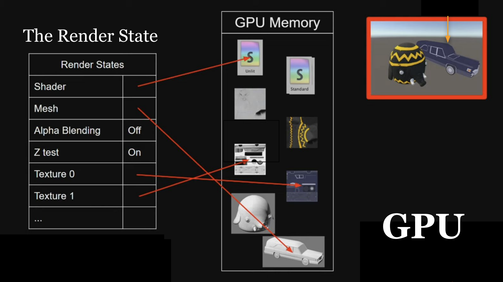
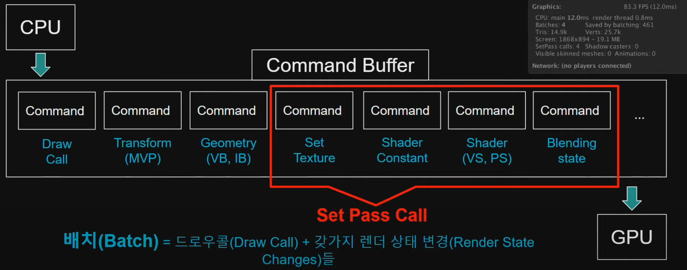
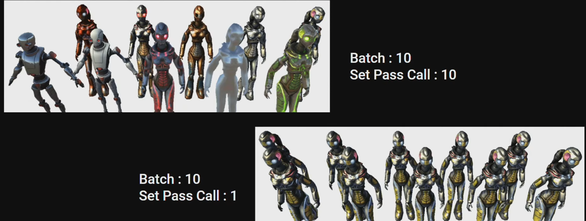

# Draw Call [#Unity Korea Youtube](https://www.youtube.com/live/UsyvT36vqpU?feature=share&t=1647)
드로우 콜을 대략 설명하면 CPU에서 GPU로 오브젝트를 그려달라고 요청하는 것을 의미한다.  

## Render State
조금 디테일하게 설명한다면 GPU에는 VRAM이 있고 그곳에 오브젝트를 그릴 때 사용하는 리소스들이 있다.  
예를 들어 Mesh, Shader, Material, Texture 등이 있다.  
이때 GPU는 다음에 화면에 그려줄 오브젝트의 리소스들을 Render State에 저장한다.  

이때 드로우 콜이 발생하면 현재 Render State에 있는 정보를 화면에 그려준다.  
그리고 다음 오브젝트를 그리려면 Render State를 수정하는 요청을 보내고 다음 드로우 콜을 발생시킨다.

## Set Pass Call
Render State를 수정하는 요청 중 Material 관련 정보를 수정하는 요청을 Set Pass Call이라고 한다.

따라서 같은 Material을 사용하는 오브젝트를 여러 개 그린다면 드로우 콜은 늘어나지만 Set Pass Call은 늘어나지 않는다.

## 에디터에서 확인
stats
frame 프로파일러